# 🍽️ Good Food - Application Mobile de Restaurant

## 📌 Description
Application mobile de gestion de restaurant permettant aux clients de :
- Consulter le menu interactif
- Passer des commandes en ligne
- Réserver une table
- Payer en ligne via Stripe

## 🛠️ Technologies Utilisées
- Frontend: Flutter (Dart)
- Backend: Go (Golang)
- Base de données: SQLite
- Paiement: Stripe API

## ✨ Fonctionnalités Principales

### 👤 Côté Client
- Authentification (Connexion / Inscription)
- Consultation du menu avec filtrage
- Recherche de plats
- Panier d'achat
- Réservation de table
- Paiement en ligne

### 🔐 Côté Administrateur
- Tableau de bord
- Gestion du menu
- Gestion des commandes
- Gestion des réservations
- Gestion des clients
## 🚀 Installation
1. Cloner le projet
2. Lancer le backend: go run main.go
3. Lancer le frontend: flutter run
## 📸 Captures d'écran

### 👤 Côté Client

| Écran | Aperçu |
|-------|--------|
| Page d'accueil | 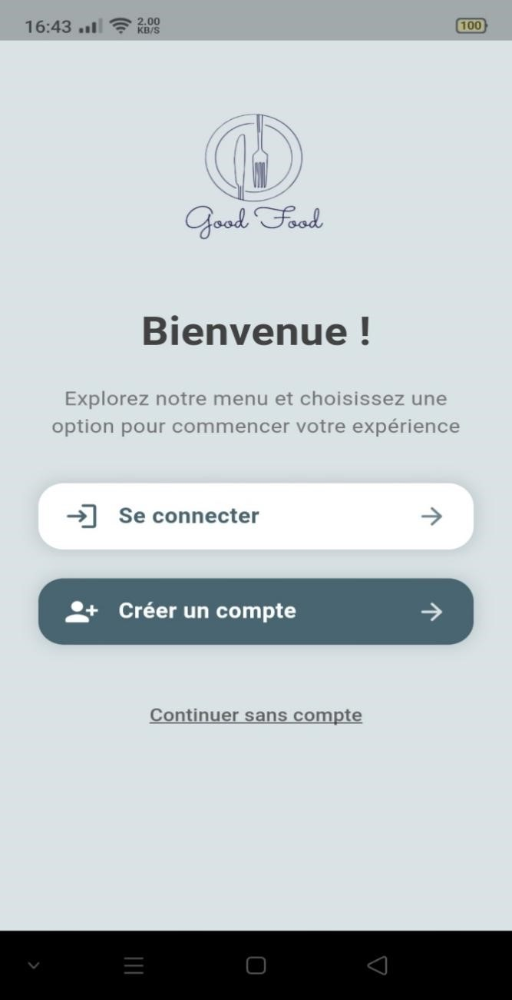 |
| Connexion | 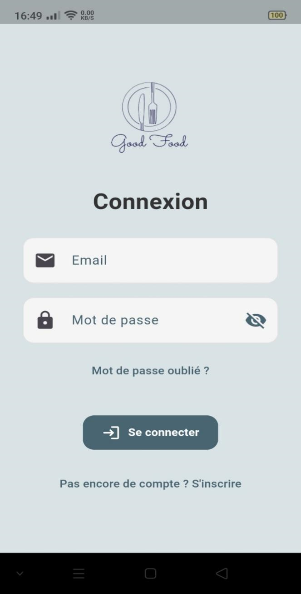 |
| Inscription | 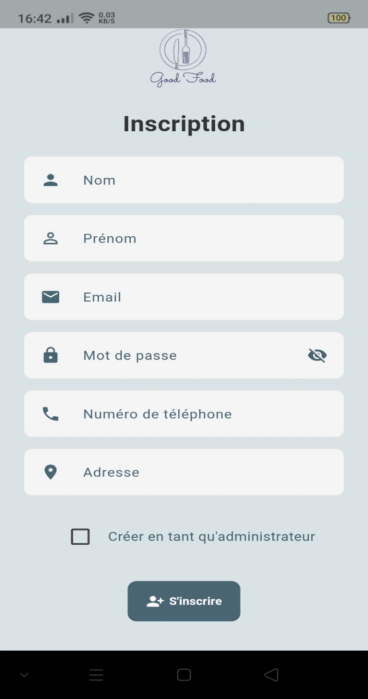 |
| Menu & Filtrage | 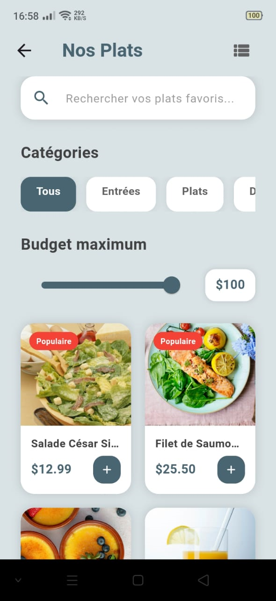 |
| Détail du plat | 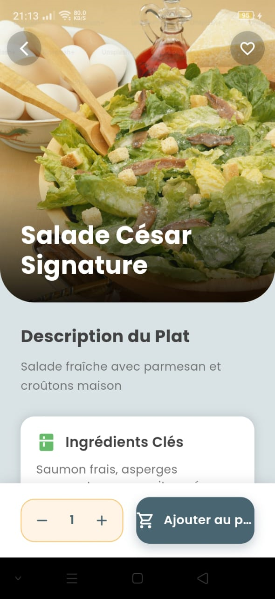 |
| Réservation | 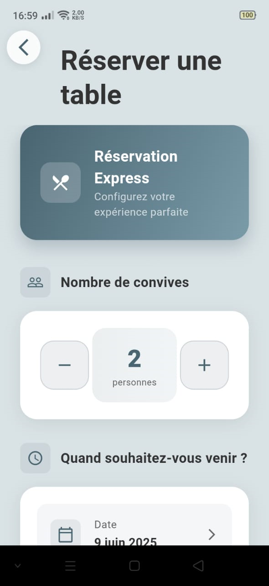 |
| Panier | 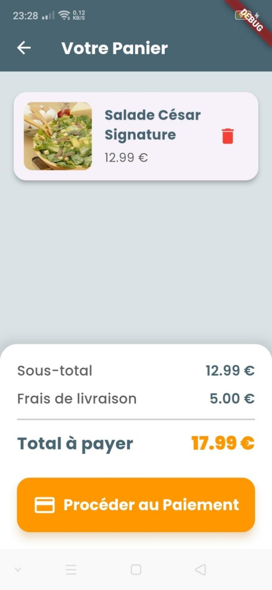 |

### 🔐 Côté Administrateur

| Écran | Aperçu |
|-------|--------|
| Dashboard Admin | 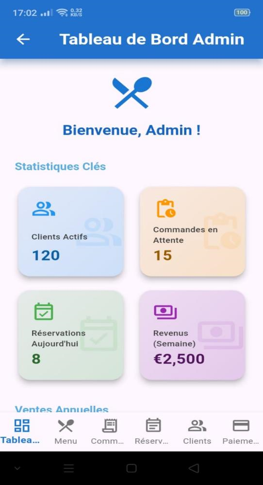 |
| Gestion du menu | 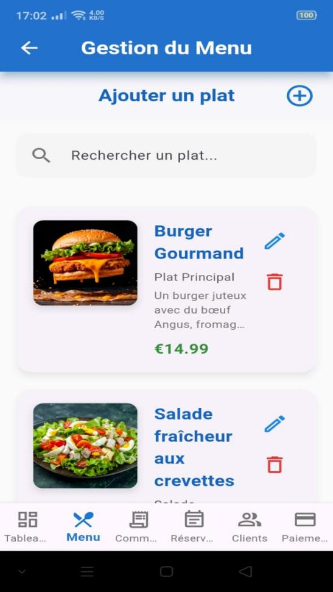 |
| Gestion des commandes | 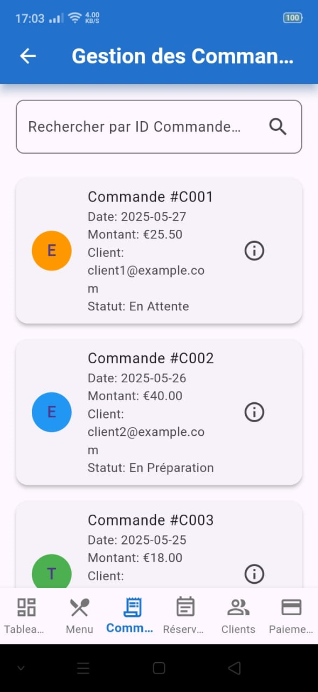 |
| Gestion des réservations | 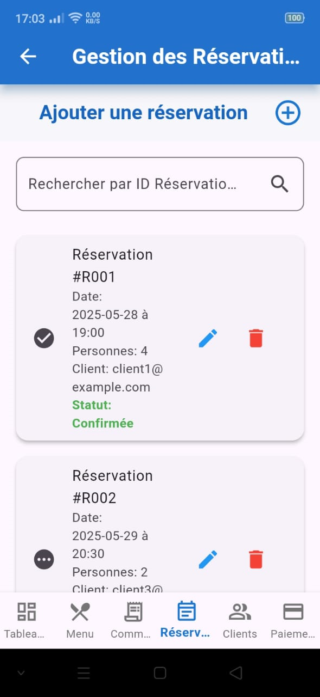 |
| Gestion des clients | 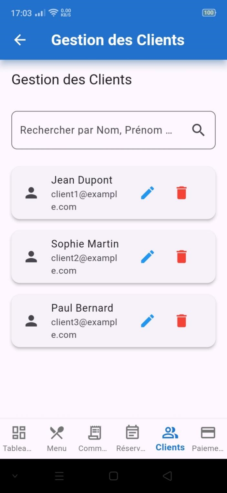 |
| Gestion des paiements | 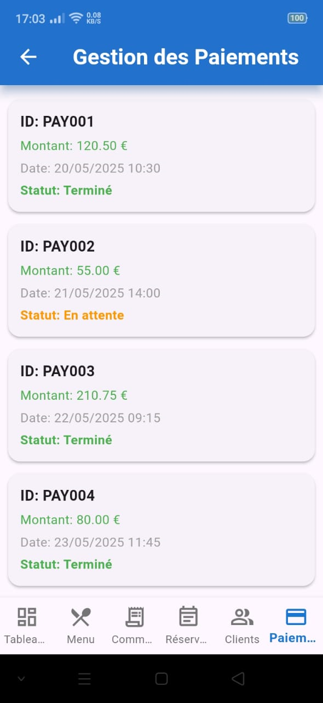 |
## 📄 Rapport
[Voir le rapport](docs/rapportPFE.pdf)
## 📞 Contact
Hiba Tibary - GitHub
